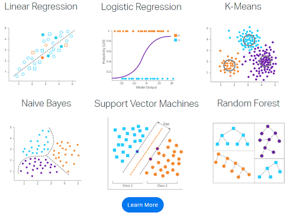

# Machine Learning and Statistics
## Table of Contents
1. [General principles in Machine Learning](#principles)
2. [General theory of statistics](#statistics)
3. [Machine Learning Models: Theory and Algorithm](#theory)

## General principles in Machine Learning <a name="principles"></a>
* **what is?** Machine learning is an application of artificial intelligence (AI) that provides systems the ability to automatically learn and improve from experience **without** being explicitly programmed.
* **examples:**



### Machine learning, Data Science and AI


### Machine learning and Physics
* **Common**: 
    * goal: seek a quantitative "model" or "theory" to explain or predict a natural phenomenon.
    * methodology: from given data derive a generalized "model" or "theory"
* **Difference**: 
    * goal: 
        * physics: a theory about everything
        * data science: a model about a particular domain of problems: natural language processing, computer vision 
    * reductionism or not: 
        * physics: complex phenomenon viewed as a collection of simpler phenomena, e.g, strongly interacting systems as a collection of weakly interacting quasiparticles
        * machine learning: find pattern among data coming from a particular domain of problem without much referring to related problems

### Bias and variance tradeoff
* Bias: preassumption of the model about the property of the problem 
* Variance: flexibility of the model to adapt to a wider range of problems

Ideally, we want correct strong bias and low variance.

#### **why bias is needed**?
**No free lunch theorem**: It states that any two optimization algorithms are equivalent when their performance is averaged across all possible problems.

**Example**: (wikipedia)

Posit a toy universe that exists for exactly two days and on each day contains exactly one object, a square or a triangle. The universe has exactly four possible histories:
1. (square, triangle): the universe contains a square on day 1, and a triangle on day 2
2. (square, square)
3. (triangle, triangle)
4. (triangle, square)

Any prediction strategy that succeeds for history #2, by predicting a square on day 2 if there is a square on day 1, will fail on history, and vice versa. If all histories are equally likely, then any prediction strategy will score the same, with the same accuracy rate of 0.5.

Thus assumptions about the property of a problem must be introduced to make a model better than random guessing. 

#### **why lower variance**?
**Simplicity**

**Occam's razor**: If two algorithms can explain the sample with similar accuracy, the one which is simpler generate better.

This claim can be justified if the universe we live in contains problem that is biased and our human mind evolves successfully to solve those problems. Then if a model is easy to understand, it means this model has a similar bias as our mind so higher chance of being applicable to a practical problem.

#### **Tradeoff**
Strong bias and lower bias means higher chance of misassumption while the opposite means lower model generalization power, e.g., picking up noises.


**In the following, we explore classical machine learning models: both their theory and implementation with code.**

**In the part [Theory](#theory), the theoretical aspect of the classical machine learning models is studied with mathematical argument and possible research directions.**

**In the part [Algorithms](#implementation), the code implementation is discussed in details as well as system design.**

**Finally, the code is compiled into a library called [my_ml_lib](my_ml_lib/)**


## Theory and Algorithm<a name="theory"></a>

1. Supervised Learning
    * Linear models
        * [theory](Theory_Algorithms/linear_models/linear_models_theory.ipynb)
        * [algorithm](Theory_Algorithms/linear_models/linear_models_algorithm.ipynb)
    * Tree based models
        * Basic Decision Tree
            * [theory](Theory_Algorithms/tree_based_models/Decision_Tree/decision_tree_theory.ipynb)
            * [algorithm](Theory_Algorithms/tree_based_models/Decision_Tree/decision_tree_algorithm.ipynb)
        * XGBoost
            * [theory](Theory_Algorithms/tree_based_models/xgboost/xgboost_theory.ipynb)
            * [algorithm](Theory_Algorithms/tree_based_models/xgboost/xgboost_algorithm.ipynb)
    * [Support vector machine theory](Theory_Algorithms/SVM/SVM.ipynb)
    * [Bayesian models theory](Theory_Algorithms/Bayes/Bayes.ipynb)
    * [time-series theory](Theory_Algorithms/time_series/Time_Series_Theory.ipynb)
2. Unsupervised Learning
    * [K-means and Gaussian Mixture Model theory](Theory_Algorithms/K-means_GMM/K-means_GMM.ipynb)

3. Online Machine Learning
    * [theory](Theory_Algorithms/Online_ML/OML_theory.ipynb)
    * [algorithm](Theory_Algorithms/Online_ML/OML_algorithm.ipynb)
4. [MCMC](Theory_Algorithms/MCMC/MCMC.ipynb)


```python

```
